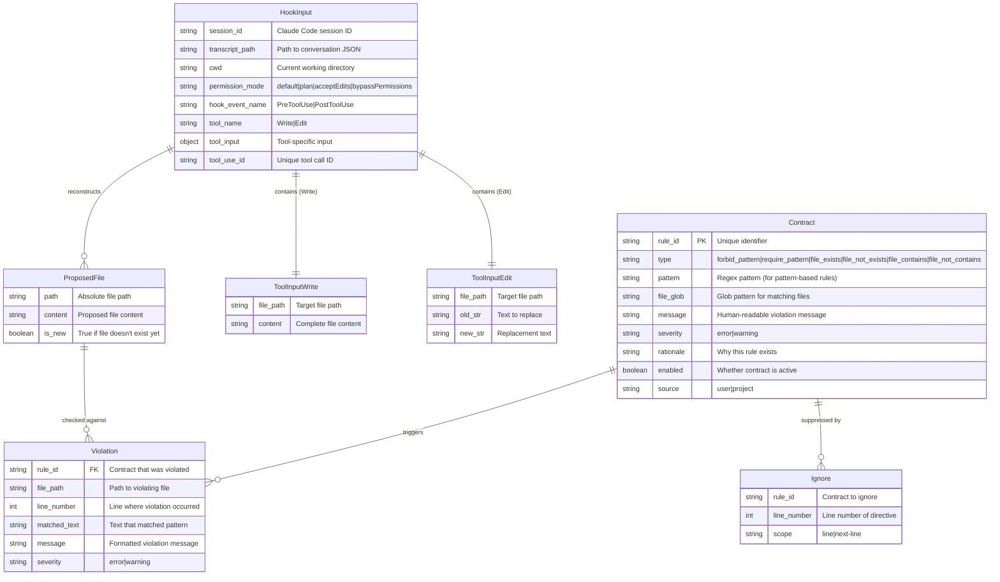

# Product Requirements Document: Hook-Based Contract Enforcement

**Version:** 3.0
**Date:** December 7, 2025
**Feature:** `phaser enforce`
**Target Release:** Phaser v1.8.0
**Status:** Final Draft

---

## 1. Synthesis

Phaser v1.8 introduces continuous contract enforcement via Claude Code hooks. When Claude attempts to write or edit a file, the `PreToolUse` hook invokes `phaser enforce --stdin`, which reads the hook input JSON (including `tool_name`, `tool_input`, and `cwd`), reconstructs the proposed file state, and checks contracts against that content. If `error`-severity violations exist, the hook outputs JSON with `permissionDecision: "deny"`, blocking the edit and providing feedback to Claude. After successful writes, the `PostToolUse` hook checks for `warning`-severity violations and surfaces them as advisory context. Developers can bypass specific rules using inline `# phaser:ignore <rule-id>` annotations. Contracts are defined at user level (`~/.phaser/contracts/`) or project level (`.claude/contracts/`), with project contracts taking precedence.

---

## 2. Data Entities

### 2.1 Entity Relationship Diagram



### 2.2 Contract Schema (YAML)

```yaml
# .claude/contracts/no-force-unwrap.yaml
rule_id: no-force-unwrap
type: forbid_pattern
pattern: '\w+!\s*(?://|$)' # Matches identifier! at end or before comment
file_glob: '**/*.swift'
message: 'Avoid force unwrapping optionals. Use guard let or if let instead.'
severity: error
rationale: 'Force unwrapping causes runtime crashes when the value is nil.'
enabled: true
```

### 2.3 Hook Input Schema (Stdin)

**PreToolUse with Write:**

```json
{
  "session_id": "abc123",
  "transcript_path": "/Users/dev/.claude/projects/myproject/00893aaf.jsonl",
  "cwd": "/Users/dev/myproject",
  "permission_mode": "default",
  "hook_event_name": "PreToolUse",
  "tool_name": "Write",
  "tool_input": {
    "file_path": "/Users/dev/myproject/src/app.swift",
    "content": "import Foundation\n\nlet value = optional!\n"
  },
  "tool_use_id": "toolu_01ABC123"
}
```

**PreToolUse with Edit:**

```json
{
  "session_id": "abc123",
  "transcript_path": "/Users/dev/.claude/projects/myproject/00893aaf.jsonl",
  "cwd": "/Users/dev/myproject",
  "permission_mode": "default",
  "hook_event_name": "PreToolUse",
  "tool_name": "Edit",
  "tool_input": {
    "file_path": "/Users/dev/myproject/src/app.swift",
    "old_str": "let value = optional",
    "new_str": "let value = optional!"
  },
  "tool_use_id": "toolu_01ABC123"
}
```

### 2.4 Hook Output Schema (Stdout)

**PreToolUse — Block (deny):**

```json
{
  "hookSpecificOutput": {
    "hookEventName": "PreToolUse",
    "permissionDecision": "deny",
    "permissionDecisionReason": "Contract violation: no-force-unwrap at line 3. Avoid force unwrapping optionals. Use guard let or if let instead."
  }
}
```

**PreToolUse — Allow:**

```json
{
  "hookSpecificOutput": {
    "hookEventName": "PreToolUse",
    "permissionDecision": "allow",
    "permissionDecisionReason": "All contracts passed"
  }
}
```

**PostToolUse — Warning:**

```json
{
  "decision": "block",
  "reason": "Contract warning detected after file write",
  "hookSpecificOutput": {
    "hookEventName": "PostToolUse",
    "additionalContext": "Warning: prefer-guard-let at line 42. Consider using guard let for cleaner early exit patterns."
  }
}
```

**PostToolUse — Clean:**

```json
{}
```

---

## 3. User Flows

### 3.1 Happy Path: Clean Write

```
┌─────────────────────────────────────────────────────────────────────────┐
│ 1. Claude prepares Write tool call                                      │
│    tool_input: { file_path: "src/new.swift", content: "..." }          │
└─────────────────────────────────────────────────────────────────────────┘
                                    │
                                    ▼
┌─────────────────────────────────────────────────────────────────────────┐
│ 2. PreToolUse hook fires                                                │
│    Stdin: { tool_name: "Write", tool_input: {...}, cwd: "..." }        │
└─────────────────────────────────────────────────────────────────────────┘
                                    │
                                    ▼
┌─────────────────────────────────────────────────────────────────────────┐
│ 3. phaser enforce --stdin --severity error                              │
│    - Parses stdin JSON                                                  │
│    - tool_input.content IS the proposed content                        │
│    - Filters contracts by file_glob match                              │
│    - Checks error-severity contracts                                    │
│    - No violations found                                                │
└─────────────────────────────────────────────────────────────────────────┘
                                    │
                                    ▼
┌─────────────────────────────────────────────────────────────────────────┐
│ 4. Hook outputs (exit 0):                                               │
│    {                                                                    │
│      "hookSpecificOutput": {                                            │
│        "hookEventName": "PreToolUse",                                   │
│        "permissionDecision": "allow"                                    │
│      }                                                                  │
│    }                                                                    │
└─────────────────────────────────────────────────────────────────────────┘
                                    │
                                    ▼
┌─────────────────────────────────────────────────────────────────────────┐
│ 5. Claude Code proceeds with Write                                      │
│    File is created successfully                                         │
└─────────────────────────────────────────────────────────────────────────┘
```

### 3.2 Error Path: Edit Blocked

```
┌─────────────────────────────────────────────────────────────────────────┐
│ 1. Claude prepares Edit tool call                                       │
│    tool_input: {                                                        │
│      file_path: "src/app.swift",                                        │
│      old_str: "let value = optional",                                   │
│      new_str: "let value = optional!"                                   │
│    }                                                                    │
└─────────────────────────────────────────────────────────────────────────┘
                                    │
                                    ▼
┌─────────────────────────────────────────────────────────────────────────┐
│ 2. PreToolUse hook fires                                                │
│    phaser enforce --stdin --severity error                              │
└─────────────────────────────────────────────────────────────────────────┘
                                    │
                                    ▼
┌─────────────────────────────────────────────────────────────────────────┐
│ 3. State reconstruction                                                 │
│    - Reads src/app.swift from disk (current state)                     │
│    - Applies: current.replace(old_str, new_str, 1)                     │
│    - Result: proposed state with "optional!" on line 42                │
└─────────────────────────────────────────────────────────────────────────┘
                                    │
                                    ▼
┌─────────────────────────────────────────────────────────────────────────┐
│ 4. Contract check finds violation                                       │
│    - no-force-unwrap pattern matches line 42                           │
│    - Severity: error                                                    │
└─────────────────────────────────────────────────────────────────────────┘
                                    │
                                    ▼
┌─────────────────────────────────────────────────────────────────────────┐
│ 5. Hook outputs (exit 0):                                               │
│    {                                                                    │
│      "hookSpecificOutput": {                                            │
│        "hookEventName": "PreToolUse",                                   │
│        "permissionDecision": "deny",                                    │
│        "permissionDecisionReason": "Contract violation: ..."           │
│      }                                                                  │
│    }                                                                    │
└─────────────────────────────────────────────────────────────────────────┘
                                    │
                                    ▼
┌─────────────────────────────────────────────────────────────────────────┐
│ 6. Claude Code blocks the Edit                                          │
│    Claude sees permissionDecisionReason in context                     │
│    Claude self-corrects: "Let me use guard let instead..."             │
└─────────────────────────────────────────────────────────────────────────┘
```

### 3.3 Bypass Path: Inline Ignore

```
┌─────────────────────────────────────────────────────────────────────────┐
│ 1. Claude prepares Write with ignore directive                          │
│    content includes: "let value = optional! // phaser:ignore ..."      │
└─────────────────────────────────────────────────────────────────────────┘
                                    │
                                    ▼
┌─────────────────────────────────────────────────────────────────────────┐
│ 2. phaser enforce parses proposed content                               │
│    Line 42: "let value = optional! // phaser:ignore no-force-unwrap"   │
└─────────────────────────────────────────────────────────────────────────┘
                                    │
                                    ▼
┌─────────────────────────────────────────────────────────────────────────┐
│ 3. Contract check                                                       │
│    - no-force-unwrap WOULD match line 42                               │
│    - Ignore directive found on same line for this rule                 │
│    - Violation suppressed                                               │
└─────────────────────────────────────────────────────────────────────────┘
                                    │
                                    ▼
┌─────────────────────────────────────────────────────────────────────────┐
│ 4. Hook outputs (exit 0):                                               │
│    {                                                                    │
│      "hookSpecificOutput": {                                            │
│        "hookEventName": "PreToolUse",                                   │
│        "permissionDecision": "allow",                                   │
│        "permissionDecisionReason": "1 violation suppressed by ignore"  │
│      }                                                                  │
│    }                                                                    │
└─────────────────────────────────────────────────────────────────────────┘
                                    │
                                    ▼
┌─────────────────────────────────────────────────────────────────────────┐
│ 5. Write proceeds with ignore comment intact                            │
└─────────────────────────────────────────────────────────────────────────┘
```

### 3.4 Edge Case: Binary File

```
┌─────────────────────────────────────────────────────────────────────────┐
│ 1. Claude prepares Write for image file                                 │
│    tool_input: { file_path: "assets/logo.png", content: "<binary>" }   │
└─────────────────────────────────────────────────────────────────────────┘
                                    │
                                    ▼
┌─────────────────────────────────────────────────────────────────────────┐
│ 2. phaser enforce attempts UTF-8 decode of content                      │
│    - Decode fails (binary content)                                      │
│    - File flagged as binary, skip enforcement                          │
└─────────────────────────────────────────────────────────────────────────┘
                                    │
                                    ▼
┌─────────────────────────────────────────────────────────────────────────┐
│ 3. Hook outputs (exit 0):                                               │
│    {} (empty = implicit allow)                                          │
└─────────────────────────────────────────────────────────────────────────┘
```

### 3.5 Edge Case: Edit old_str Not Found

```
┌─────────────────────────────────────────────────────────────────────────┐
│ 1. Claude prepares Edit with stale old_str                              │
│    old_str doesn't exist in current file on disk                       │
└─────────────────────────────────────────────────────────────────────────┘
                                    │
                                    ▼
┌─────────────────────────────────────────────────────────────────────────┐
│ 2. phaser enforce attempts reconstruction                               │
│    - Reads file from disk                                               │
│    - old_str not found in content                                       │
│    - Cannot reconstruct proposed state                                  │
└─────────────────────────────────────────────────────────────────────────┘
                                    │
                                    ▼
┌─────────────────────────────────────────────────────────────────────────┐
│ 3. Hook outputs (exit 0):                                               │
│    {} (empty = implicit allow)                                          │
│    Phaser allows; Claude Code's own validation handles mismatch        │
└─────────────────────────────────────────────────────────────────────────┘
```

### 3.6 Edge Case: No Contracts Configured

```
┌─────────────────────────────────────────────────────────────────────────┐
│ 1. phaser enforce runs but no contracts in either location              │
│    - .claude/contracts/ doesn't exist or is empty                      │
│    - ~/.phaser/contracts/ doesn't exist or is empty                    │
└─────────────────────────────────────────────────────────────────────────┘
                                    │
                                    ▼
┌─────────────────────────────────────────────────────────────────────────┐
│ 2. Hook outputs (exit 0):                                               │
│    {} (empty = implicit allow)                                          │
└─────────────────────────────────────────────────────────────────────────┘
```

---

## 4. Non-Functional Requirements

### 4.1 Performance

| Metric               | Target      | Measurement                    |
| -------------------- | ----------- | ------------------------------ |
| Total hook latency   | < 100ms p95 | Hook invocation to exit        |
| Stdin parsing        | < 5ms       | JSON parse time                |
| State reconstruction | < 10ms      | File read + string replace     |
| Contract loading     | < 10ms      | Parse all YAML files           |
| Contract matching    | < 50ms      | All contracts against one file |
| Regex timeout        | 100ms max   | Per-pattern, prevents ReDoS    |

### 4.2 Security

| Requirement           | Implementation                               |
| --------------------- | -------------------------------------------- |
| No code execution     | Contracts define regex patterns only         |
| No network access     | Fully offline enforcement                    |
| Read-only disk access | Only reads current file state for Edit       |
| Regex DoS protection  | 100ms timeout per pattern via `regex` module |
| Path validation       | Reject paths containing `..`                 |
| Stdin size limit      | Max 10MB input                               |

### 4.3 Data Persistence

| Data                | Location                     | Lifecycle                      |
| ------------------- | ---------------------------- | ------------------------------ |
| User contracts      | `~/.phaser/contracts/*.yaml` | Persistent, user-managed       |
| Project contracts   | `.claude/contracts/*.yaml`   | Persistent, version-controlled |
| Enforcement results | stdout only                  | Ephemeral                      |

### 4.4 Compatibility

| Requirement        | Details                              |
| ------------------ | ------------------------------------ |
| Python             | 3.10+                                |
| Claude Code        | 1.0+ (hooks support)                 |
| OS                 | macOS, Linux, WSL                    |
| Existing contracts | Backward-compatible with v1.2 schema |

---

## 5. CLI Specification

### 5.1 Command: `phaser enforce`

```
Usage: phaser enforce [OPTIONS]

Check contracts against proposed file changes.

Options:
  --stdin               Read hook input JSON from stdin (required for hooks)
  --file PATH           Check contracts for file on disk (for CI/manual use)
  --all                 Check all files against all contracts (for CI)
  --severity [error|warning|all]
                        Filter violations by severity [default: all]
  --format [hook|json|text]
                        Output format [default: hook when --stdin, text otherwise]
  --contracts-dir PATH  Override contracts directory
  --timeout MS          Regex timeout in milliseconds [default: 100]
  --quiet               Suppress informational output
  --help                Show this message and exit.

Exit Codes:
  0  Success (output JSON controls decision)
  3  Internal error (stdin parse failure, contract load error)

Notes:
  - All decision logic is communicated via JSON output, not exit codes
  - Exit code 0 is used for both allow and deny decisions
  - Exit code 3 indicates the hook could not run properly

Examples:
  # Hook usage (stdin mode) - PreToolUse
  phaser enforce --stdin --severity error

  # Hook usage (stdin mode) - PostToolUse
  phaser enforce --stdin --severity warning

  # Manual check against file on disk
  phaser enforce --file src/app.swift --format text

  # CI check (all files)
  phaser enforce --all --format text
```

### 5.2 Output Formats

**`--format hook` (default for --stdin):**

```json
{
  "hookSpecificOutput": {
    "hookEventName": "PreToolUse",
    "permissionDecision": "deny",
    "permissionDecisionReason": "Contract violation: no-force-unwrap at line 3"
  }
}
```

**`--format json`:**

```json
{
  "files_checked": ["src/app.swift"],
  "violations": [
    {
      "rule_id": "no-force-unwrap",
      "file_path": "src/app.swift",
      "line_number": 3,
      "message": "Avoid force unwrapping optionals"
    }
  ],
  "summary": { "errors": 1, "warnings": 0, "ignored": 0 }
}
```

**`--format text`:**

```
src/app.swift:3: error: no-force-unwrap
  Avoid force unwrapping optionals. Use guard let or if let instead.

1 error, 0 warnings
```

### 5.3 Command: `phaser enforce install`

```
Usage: phaser enforce install [OPTIONS]

Install hook configuration for Claude Code.

Options:
  --scope [user|project|local]
                        Where to install [default: project]
  --dry-run             Print config without writing
  --force               Overwrite existing hooks
  --help                Show this message and exit.

Output:
  Merges hook configuration into:
  - project: .claude/settings.json
  - local: .claude/settings.local.json
  - user: ~/.claude/settings.json
```

---

## 6. Ignore Directive Specification

### 6.1 Syntax

```
# phaser:ignore <rule-id>           Suppresses violation on THIS line
# phaser:ignore-next-line <rule-id> Suppresses violation on NEXT line
# phaser:ignore-all                 Suppresses ALL violations on this line
```

### 6.2 Comment Style Detection

Based on file extension:

| Extensions                                                                         | Comment Pattern       |
| ---------------------------------------------------------------------------------- | --------------------- |
| `.py`, `.rb`, `.sh`, `.yaml`, `.yml`                                               | `# phaser:...`        |
| `.js`, `.ts`, `.jsx`, `.tsx`, `.swift`, `.go`, `.rs`, `.c`, `.cpp`, `.java`, `.kt` | `// phaser:...`       |
| `.html`, `.xml`, `.vue`, `.svelte`                                                 | `<!-- phaser:... -->` |
| `.css`, `.scss`, `.less`                                                           | `/* phaser:... */`    |

### 6.3 Multiple Rules

```swift
let a = x! // phaser:ignore no-force-unwrap, no-single-letter-vars
```

### 6.4 Parsing Rules

1. Ignore directives are parsed from the **proposed content**, not disk
2. For `phaser:ignore`, the directive must be on the same line as the violation
3. For `phaser:ignore-next-line`, the directive must be on the line immediately preceding the violation
4. Rule IDs are matched case-sensitively
5. Unknown rule IDs in ignore directives are silently ignored (no error)

---

## 7. State Reconstruction Specification

### 7.1 Tool Type Handlers

```python
from dataclasses import dataclass
from pathlib import Path
from typing import Optional

@dataclass
class ProposedFile:
    path: str
    content: str
    is_new: bool

@dataclass
class ReconstructionResult:
    files: list[ProposedFile]
    skipped: bool
    skip_reason: Optional[str]

def reconstruct(hook_input: dict) -> ReconstructionResult:
    """Reconstruct proposed file state(s) from hook input."""

    tool_name = hook_input.get("tool_name")
    tool_input = hook_input.get("tool_input", {})

    if tool_name == "Write":
        path = tool_input.get("file_path", "")
        content = tool_input.get("content", "")

        # Check if content is valid UTF-8 text
        if not is_valid_text(content):
            return ReconstructionResult(
                files=[],
                skipped=True,
                skip_reason="Binary content detected"
            )

        return ReconstructionResult(
            files=[ProposedFile(
                path=path,
                content=content,
                is_new=not Path(path).exists()
            )],
            skipped=False,
            skip_reason=None
        )

    elif tool_name == "Edit":
        path = tool_input.get("file_path", "")
        old_str = tool_input.get("old_str", "")
        new_str = tool_input.get("new_str", "")

        # File must exist for Edit
        if not Path(path).exists():
            return ReconstructionResult(
                files=[],
                skipped=True,
                skip_reason=f"File not found: {path}"
            )

        # Read current content
        try:
            current = Path(path).read_text(encoding="utf-8")
        except UnicodeDecodeError:
            return ReconstructionResult(
                files=[],
                skipped=True,
                skip_reason="Binary file detected"
            )

        # old_str must exist in current content
        if old_str not in current:
            return ReconstructionResult(
                files=[],
                skipped=True,
                skip_reason="old_str not found in file"
            )

        # Apply replacement (first occurrence only)
        proposed = current.replace(old_str, new_str, 1)

        return ReconstructionResult(
            files=[ProposedFile(
                path=path,
                content=proposed,
                is_new=False
            )],
            skipped=False,
            skip_reason=None
        )

    else:
        # Unknown tool - skip enforcement
        return ReconstructionResult(
            files=[],
            skipped=True,
            skip_reason=f"Unknown tool: {tool_name}"
        )


def is_valid_text(content: str) -> bool:
    """Check if content appears to be valid text (not binary)."""
    try:
        # Check for null bytes (common in binary)
        if '\x00' in content:
            return False
        # Check for high ratio of non-printable characters
        non_printable = sum(1 for c in content if ord(c) < 32 and c not in '\n\r\t')
        if len(content) > 0 and non_printable / len(content) > 0.1:
            return False
        return True
    except Exception:
        return False
```

### 7.2 Error Handling Summary

| Condition                   | Behavior                     | Output             |
| --------------------------- | ---------------------------- | ------------------ |
| Write with valid text       | Reconstruct, check contracts | JSON decision      |
| Write with binary content   | Skip enforcement             | Empty JSON (allow) |
| Edit with file exists       | Reconstruct, check contracts | JSON decision      |
| Edit with file not found    | Skip enforcement             | Empty JSON (allow) |
| Edit with old_str not found | Skip enforcement             | Empty JSON (allow) |
| Edit with binary file       | Skip enforcement             | Empty JSON (allow) |
| Unknown tool_name           | Skip enforcement             | Empty JSON (allow) |
| Malformed stdin JSON        | Internal error               | Exit 3             |

---

## 8. Hook Configuration

### 8.1 Generated Configuration

```json
{
  "hooks": {
    "PreToolUse": [
      {
        "matcher": "Edit|Write",
        "hooks": [
          {
            "type": "command",
            "command": "phaser enforce --stdin --severity error",
            "timeout": 60
          }
        ]
      }
    ],
    "PostToolUse": [
      {
        "matcher": "Edit|Write",
        "hooks": [
          {
            "type": "command",
            "command": "phaser enforce --stdin --severity warning",
            "timeout": 60
          }
        ]
      }
    ]
  }
}
```

### 8.2 Hook Behavior Matrix

| Hook        | Severity Filter | On Violation                              | On Clean                      |
| ----------- | --------------- | ----------------------------------------- | ----------------------------- |
| PreToolUse  | `error` only    | `permissionDecision: "deny"`              | `permissionDecision: "allow"` |
| PostToolUse | `warning` only  | `decision: "block"` + `additionalContext` | Empty JSON                    |

### 8.3 Known Limitations

| Limitation   | Description                                  | Workaround                                               |
| ------------ | -------------------------------------------- | -------------------------------------------------------- |
| Bash bypass  | Files written via `echo > file` bypass hooks | Document as known limitation; consider Bash hook in v1.9 |
| No MultiEdit | MultiEdit tool not supported                 | Defer until tool is documented                           |
| 60s timeout  | Long-running checks may timeout              | Optimize contract patterns, reduce contract count        |

---

## 9. Contract Loading

### 9.1 Search Locations (Precedence Order)

1. `.claude/contracts/*.yaml` — Project contracts (highest precedence)
2. `~/.phaser/contracts/*.yaml` — User contracts (lower precedence)

The `cwd` from hook input is used to locate `.claude/contracts/`.

### 9.2 Conflict Resolution

If the same `rule_id` exists in both locations, the **project contract wins**.

### 9.3 Contract Validation

On load, each contract file is validated:

| Field       | Required          | Validation                                                                                                          |
| ----------- | ----------------- | ------------------------------------------------------------------------------------------------------------------- |
| `rule_id`   | Yes               | Alphanumeric + hyphens, 1-64 chars                                                                                  |
| `type`      | Yes               | One of: `forbid_pattern`, `require_pattern`, `file_exists`, `file_not_exists`, `file_contains`, `file_not_contains` |
| `pattern`   | For pattern types | Valid regex (compiled test)                                                                                         |
| `file_glob` | Yes               | Valid glob syntax                                                                                                   |
| `severity`  | Yes               | `error` or `warning`                                                                                                |
| `message`   | Yes               | Non-empty string                                                                                                    |
| `enabled`   | No                | Boolean, defaults to `true`                                                                                         |
| `rationale` | No                | String, informational only                                                                                          |

**Invalid contracts are skipped** with a warning logged to stderr (does not affect exit code).

### 9.4 Contract Type Semantics

| Type                | Triggers Violation When                 |
| ------------------- | --------------------------------------- |
| `forbid_pattern`    | Pattern MATCHES anywhere in file        |
| `require_pattern`   | Pattern does NOT match anywhere in file |
| `file_exists`       | File matching glob does NOT exist       |
| `file_not_exists`   | File matching glob DOES exist           |
| `file_contains`     | File does NOT contain pattern           |
| `file_not_contains` | File DOES contain pattern               |

---

## 10. File Structure

```
Phaser/
├── tools/
│   ├── enforce.py           # NEW: Main enforcement engine + CLI
│   ├── tool_input.py        # NEW: Parse stdin, reconstruct state
│   ├── ignore_parser.py     # NEW: Parse ignore directives
│   ├── contract_loader.py   # NEW: Load and validate contracts
│   ├── contracts.py         # EXISTING: Keep for backward compat
│   └── cli.py               # EXTEND: Add enforce subcommand group
├── tests/
│   ├── test_enforce.py          # NEW: Integration tests
│   ├── test_tool_input.py       # NEW: Reconstruction tests
│   ├── test_ignore_parser.py    # NEW: Ignore directive tests
│   ├── test_contract_loader.py  # NEW: Contract loading tests
│   └── fixtures/
│       ├── contracts/           # NEW: Test contract files
│       └── hook_inputs/         # NEW: Sample hook input JSON
├── specs/
│   └── enforce.md           # NEW: This specification
└── templates/
    └── hooks.json           # NEW: Hook config template
```

---

## 11. Module Specifications

### 11.1 `tools/enforce.py`

Primary responsibilities:

- CLI entry point for `phaser enforce`
- Orchestrates reconstruction → loading → checking → output
- Formats output for hook consumption

### 11.2 `tools/tool_input.py`

Primary responsibilities:

- Parse stdin JSON
- Dispatch to Write/Edit handlers
- Reconstruct proposed file content
- Handle edge cases (binary, missing file, etc.)

### 11.3 `tools/ignore_parser.py`

Primary responsibilities:

- Detect comment style from file extension
- Extract ignore directives from content
- Match directives to violations by line number

### 11.4 `tools/contract_loader.py`

Primary responsibilities:

- Discover contract files in both locations
- Parse and validate YAML
- Merge with precedence rules
- Cache compiled regex patterns

---

## 12. Success Criteria

| Criterion           | Target                             | Verification                    |
| ------------------- | ---------------------------------- | ------------------------------- |
| Latency p95         | < 100ms                            | Benchmark with 20 contracts     |
| Test coverage       | > 90%                              | pytest-cov on new modules       |
| False negative rate | 0%                                 | Test corpus of known violations |
| Ignore accuracy     | 100%                               | Test all comment styles         |
| Backward compat     | `phaser contracts check` unchanged | Existing tests pass             |
| Documentation       | Complete                           | README section, `--help` text   |

---

## 13. Out of Scope

| Feature                   | Rationale                     | Target Version  |
| ------------------------- | ----------------------------- | --------------- |
| Auto-fix suggestions      | Higher complexity/risk        | v1.9            |
| Subagent integration      | Depends on Plugin work        | v1.9            |
| IDE/LSP integration       | Claude Code is IDE layer      | Not planned     |
| Remote contracts          | Offline-first design          | Not planned     |
| MultiEdit support         | Not documented in Claude Code | When documented |
| Bash file write detection | Complex, many false positives | v1.9 evaluation |

---

## 14. Risks and Mitigations

| Risk                   | Likelihood | Impact | Mitigation                                     |
| ---------------------- | ---------- | ------ | ---------------------------------------------- |
| Hook timeout           | Medium     | High   | 100ms regex timeout, early exit on first error |
| False positives        | Medium     | High   | Inline ignores, severity levels, good patterns |
| Large file latency     | Low        | Medium | Stream parsing, 10MB limit                     |
| Malformed stdin        | Low        | Medium | Defensive parsing, exit 3                      |
| Edit field names wrong | Low        | High   | Validate empirically, handle gracefully        |

---

## 15. Testing Strategy

### 15.1 Unit Tests

| Module               | Test Focus                                |
| -------------------- | ----------------------------------------- |
| `tool_input.py`      | Write/Edit reconstruction, edge cases     |
| `ignore_parser.py`   | All comment styles, multi-rule, next-line |
| `contract_loader.py` | YAML parsing, validation, precedence      |
| `enforce.py`         | Output formatting, severity filtering     |

### 15.2 Integration Tests

| Scenario          | Validation                            |
| ----------------- | ------------------------------------- |
| Clean Write       | Exit 0, `permissionDecision: "allow"` |
| Violation blocked | Exit 0, `permissionDecision: "deny"`  |
| Ignore applied    | Exit 0, violation suppressed          |
| Binary file       | Exit 0, empty output                  |
| No contracts      | Exit 0, empty output                  |
| Malformed stdin   | Exit 3                                |

### 15.3 End-to-End Tests

Manual testing in Claude Code:

1. Install hooks via `phaser enforce install`
2. Create a contract
3. Ask Claude to write violating code
4. Verify block + Claude self-correction
5. Ask Claude to add ignore directive
6. Verify bypass works

---

_Phaser v1.8 — Hook-Based Contract Enforcement PRD v3.0_
